# Fingerprint2 demo 使用教程

## 该demo只适用于M5Stack CoreS3/-SE/-Lite

### 1.启动后进入主界面

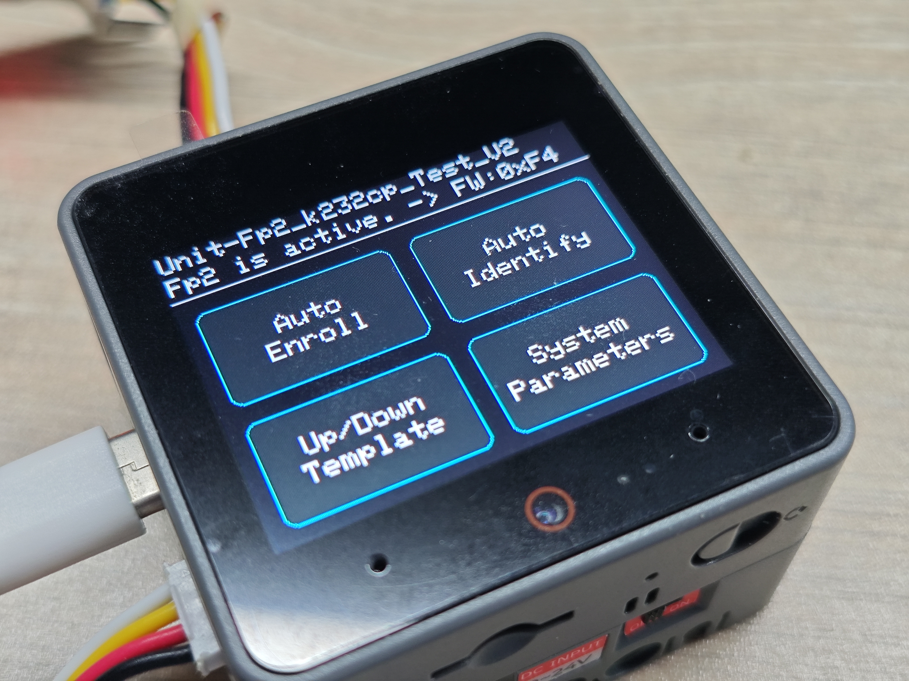

左上角：指纹录入 右上角：指纹验证

左下角：模板上传下载 右下角：查看系统寄存器

在主界面长按指纹模块，将自动显示指纹图像

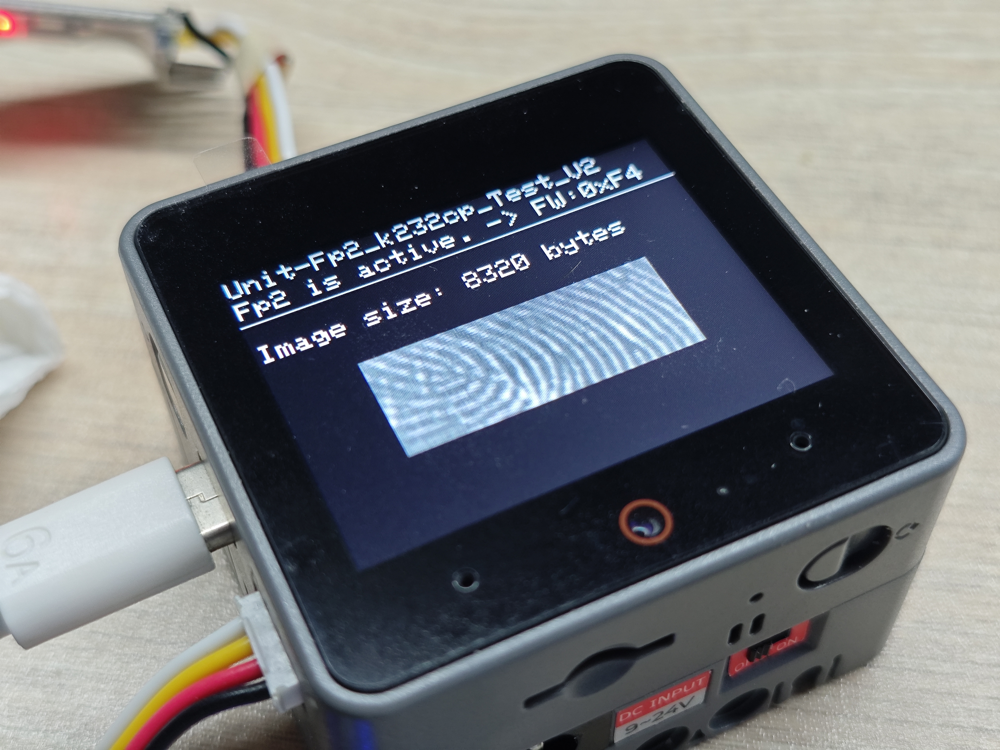

### 2.录入指纹

### 2.1点击左上角打开指纹录入

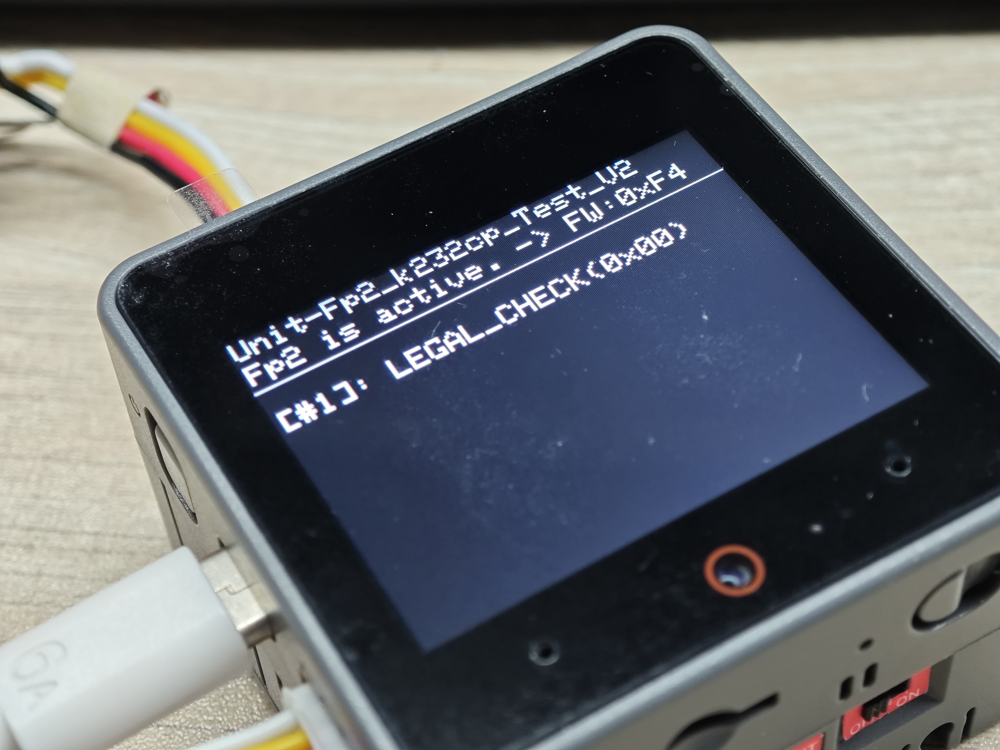

### 2.2放下手指，第一次

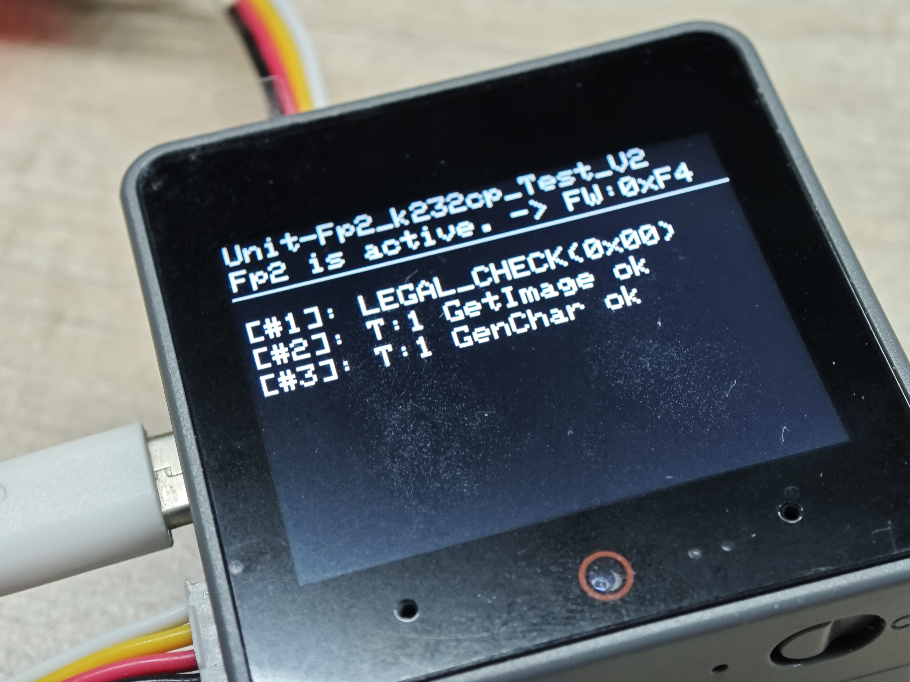

### 2.3然后松开手指（程序可配置为不需要抬起手指）

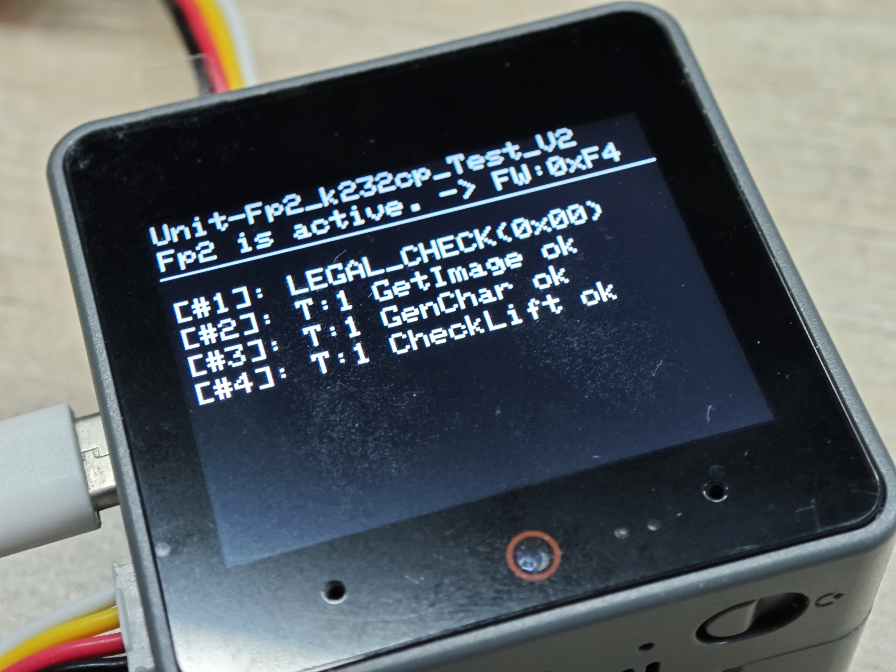

### 2.4再次放下手指

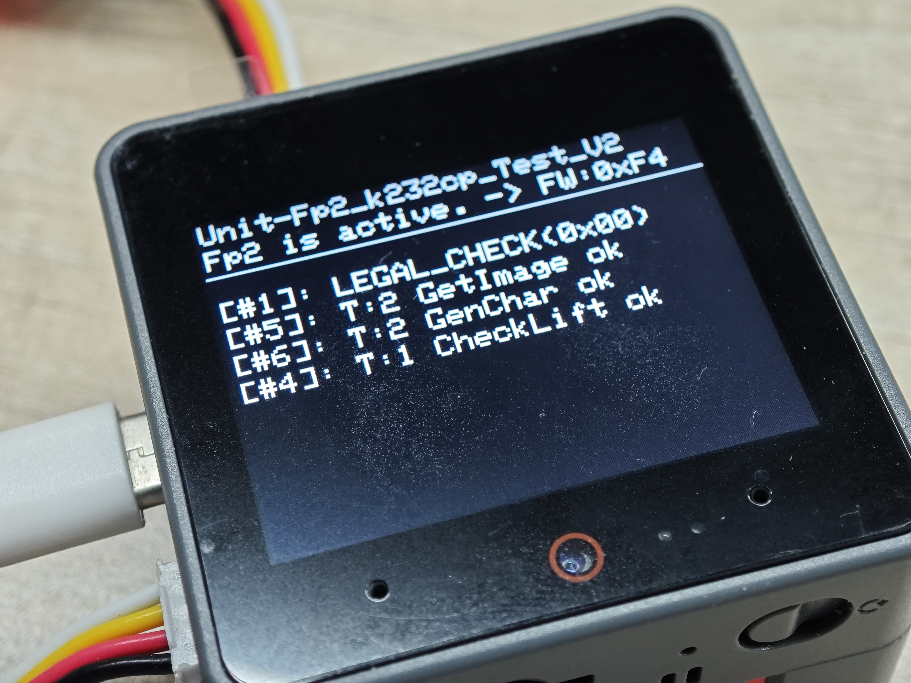

### 2.5然后再次抬起手指

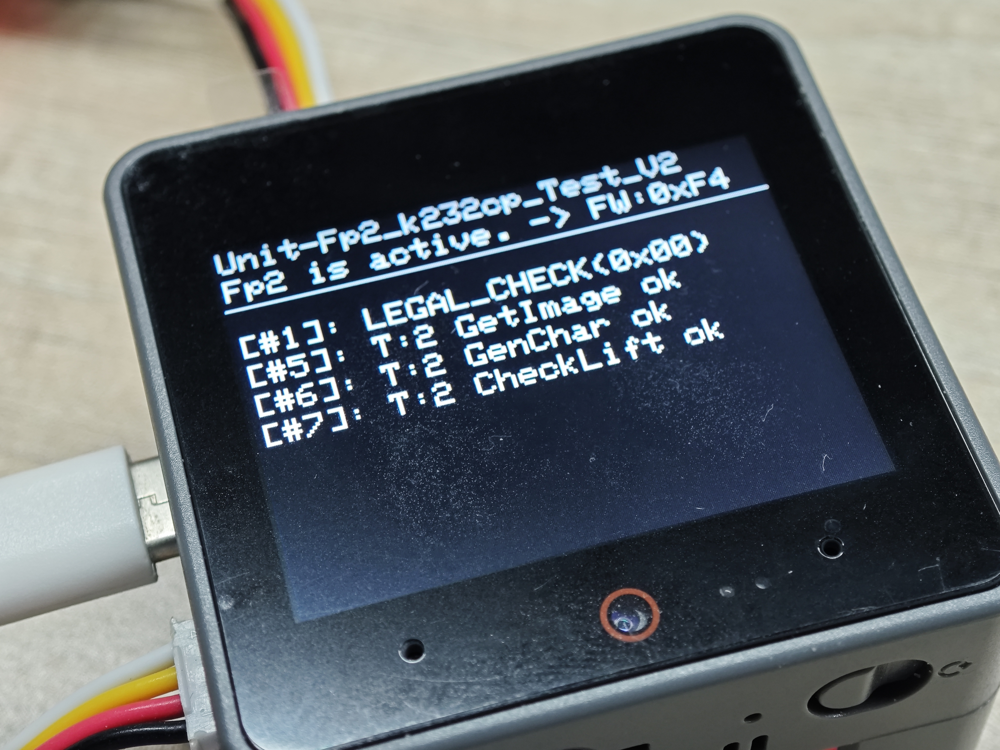

### 2.6再次放下手指（本程序设置为3次，程序可自定义）

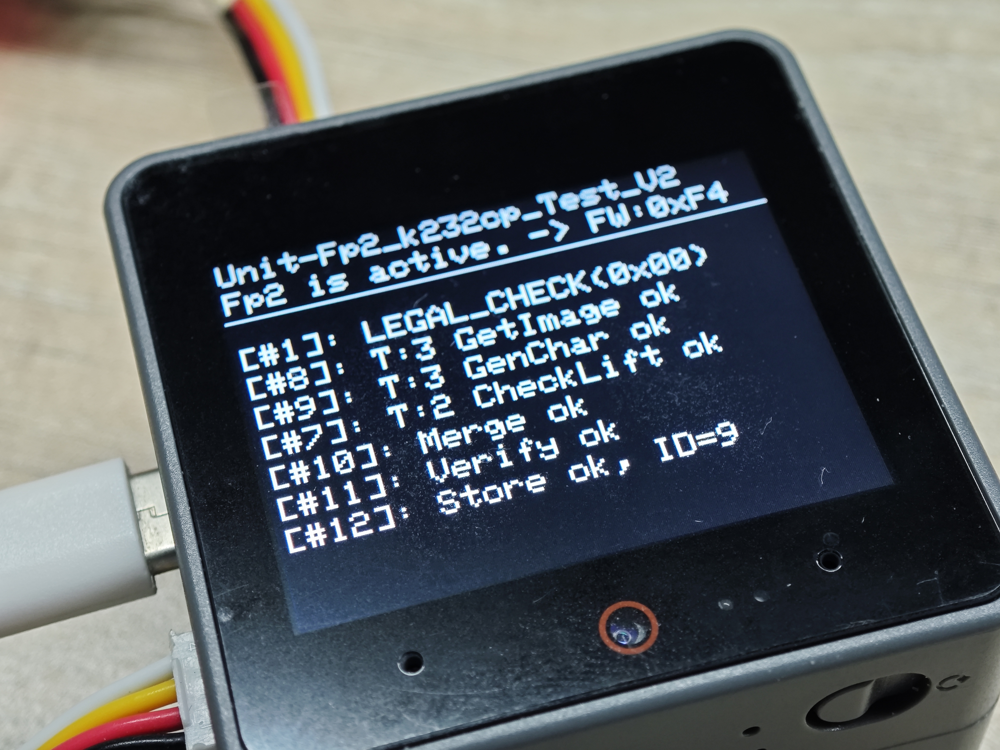

显示Store ok即为录入成功，程序也通过次判断是否成功。

## 3指纹验证

### 3.1点击右上角，打开指纹验证界面

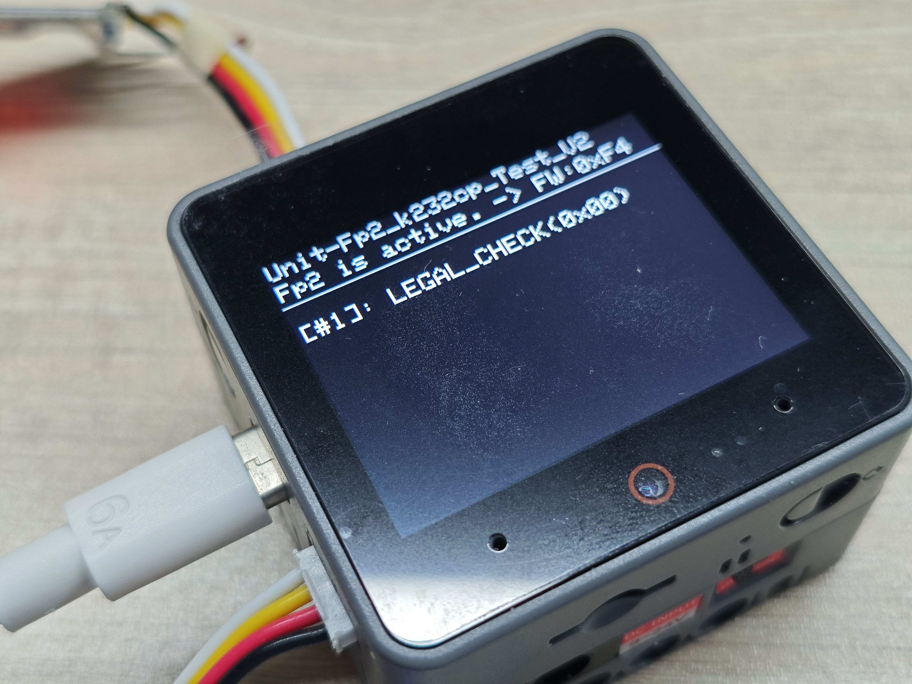

### 3.2放下手指，若失败

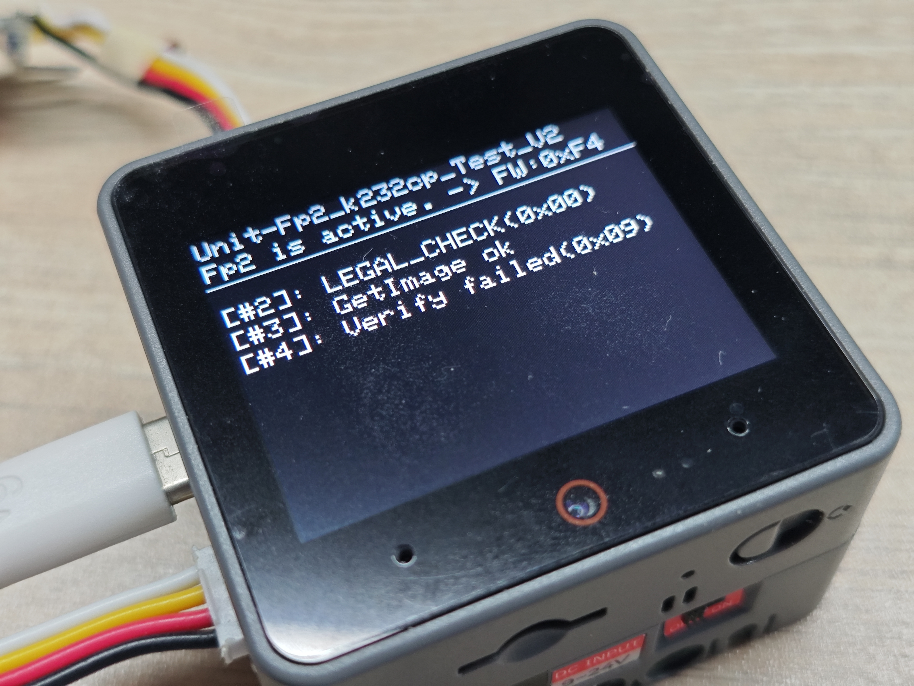

### 3.3若成功，会显示存储的页号和比对分数

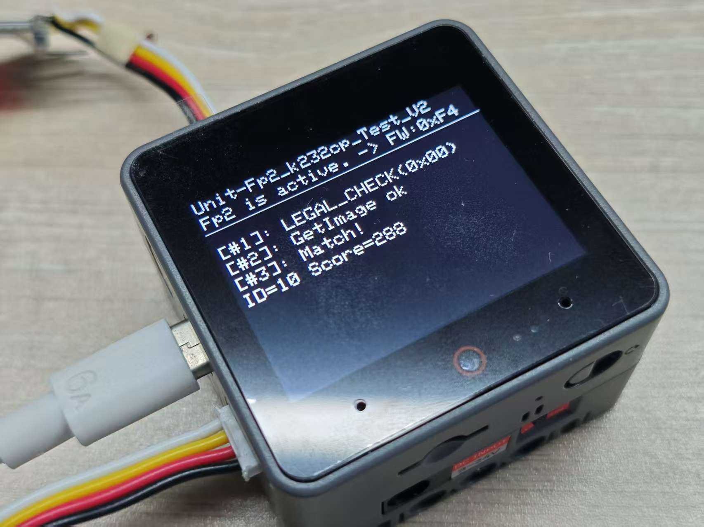

## 4模板上传下载

点击左下角，进入模板上传下载预览页面

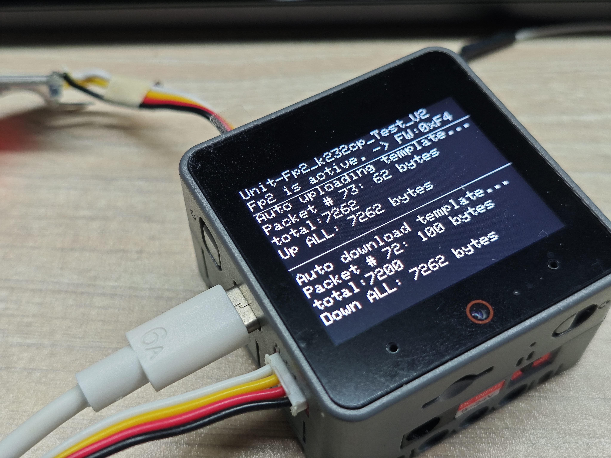

该页面主要演示模板的上传下载的数据包传输过程，具体实现可参考源码。

## 5模块内部的系统寄存器显示

点击右下角，显示内部的寄存器信息

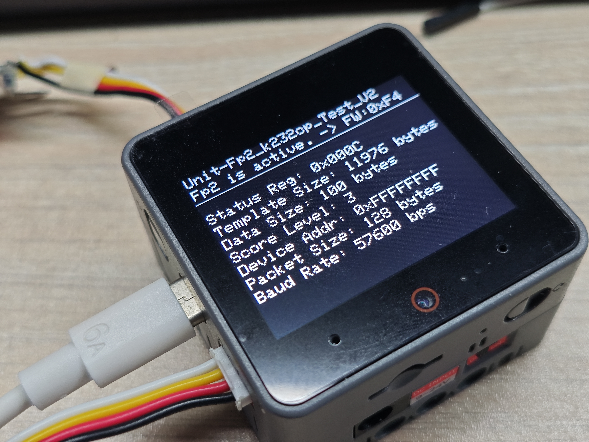

注：不能在使用m5unit-fingerprint2-library的情况下，调整数据包的大小，该库的一些操作没有对数据包大小进行自适应。 -截止 25/8/6
